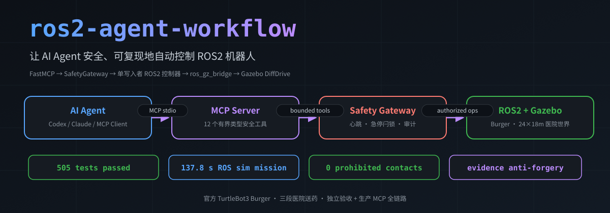
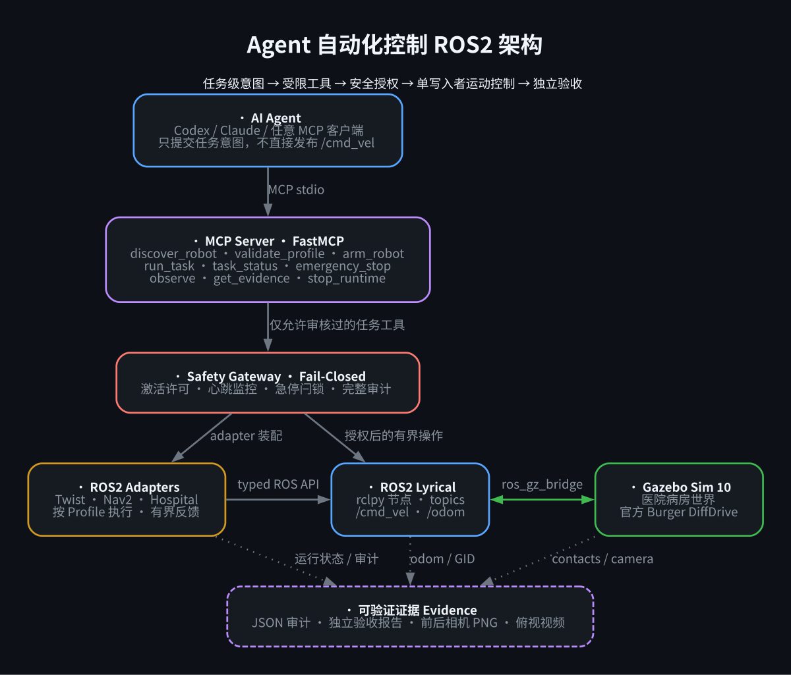
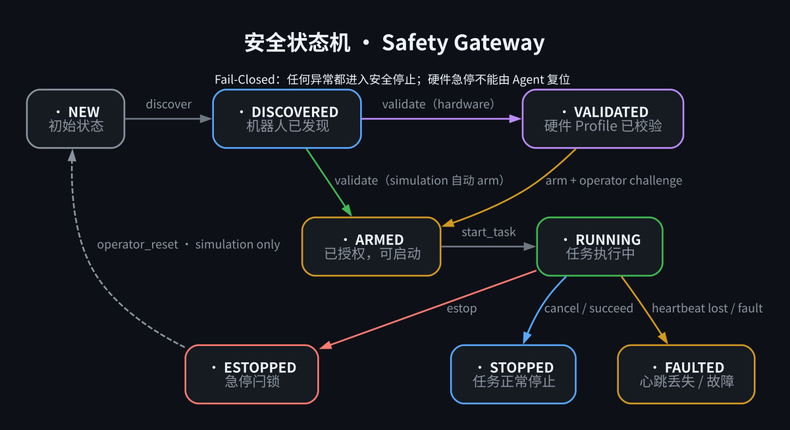
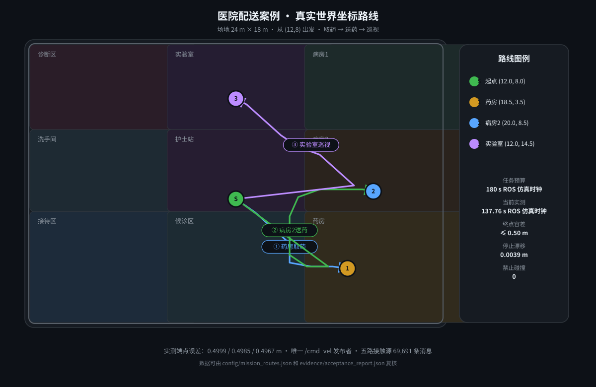
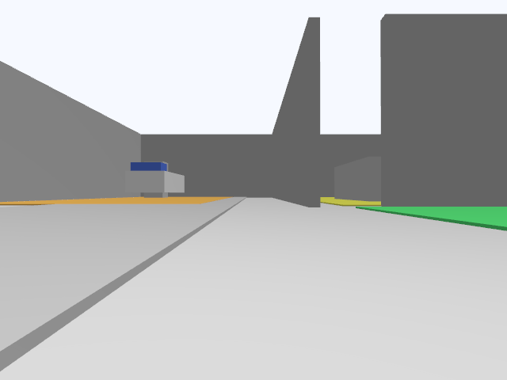
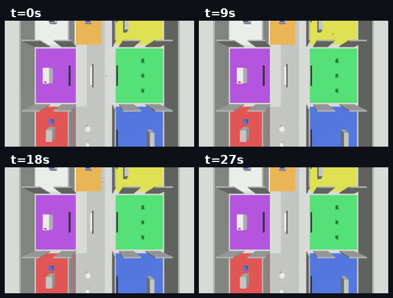

<div align="center">



**让 AI Agent 安全、可复现地自动控制 ROS2 机器人的开源框架 —— 以"中国机器人大赛暨RoboCup·送药巡诊机器人赛项"为完整验证案例**

English entry point: [README.en.md](README.en.md) · 发布核对：[docs/RELEASE.md](docs/RELEASE.md)

> **English Abstract**: A safe, reproducible Agent-to-ROS2 automation framework.
> Codex or any MCP client issues bounded task-level commands through FastMCP;
> a fail-closed SafetyGateway authorizes motion; a single-writer ROS2 controller
> drives a Gazebo TurtleBot3 Burger through a hospital delivery mission;
> independent acceptance evidence, terminal snapshots, and 505 unique tests make
> the result verifiable.

[](https://docs.ros.org)
[](https://gazebosim.org)
[](https://www.python.org)
[](https://modelcontextprotocol.io)
[](#-跑测试505-个)
[](examples/hospital_delivery/evidence/acceptance_report.json)
[](#-参考案例医院配送送药巡诊机器人赛项)
[](LICENSE)
[](https://github.com/TmxjTmxj/ros2-agent-workflow/actions/workflows/ci.yml)

</div>

---

## 📖 目录

- [项目是什么](#-项目是什么)
- [架构总览](#-架构总览)
- [核心组件](#-核心组件)
- [参考案例：医院配送](#-参考案例医院配送送药巡诊机器人赛项)
- [快速开始](#-快速开始)
- [项目结构](#-项目结构)
- [测试与质量](#-测试与质量)
- [真机适配与贡献](#-真机适配与贡献)
- [License](#-license)

---

## 🎯 项目是什么

这是一个 **基于 Codex（OpenAI）的 ROS2 自动化控制框架**：AI Agent 通过 **MCP 协议** 连接 ROS2 + Gazebo 仿真环境，以**任务级意图**（"把药从药房送到病房2"）驱动机器人完成复杂任务，而不是逐条下发底层指令。

项目的标准工作流边界是：

```text
Profile → SafetyGateway → Adapter → evidence
```

其中 Profile 描述经过审查的机器人与任务，SafetyGateway 保持 fail-closed
授权，Adapter 只执行白名单动作，evidence 由独立验收链路保存。医院送药是这套
标准工作流的**完整验证示例**，不是项目唯一的产品边界。

**项目的核心价值：**

| 特点 | 说明 |
|------|------|
| 🧠 **Agent 驱动** | Codex / Claude / 任意 MCP 客户端即可操控 ROS2 |
| 🔒 **Fail-Closed 安全** | 激活许可 + 心跳监控 + 急停闩锁 + 完整审计,任何异常都安全停机 |
| 📦 **可复现** | 声明式 Profile 描述机器人能力,一键运行完整验证 |
| 🧪 **赛题案例** | 以"送药巡诊机器人赛项"为完整参考案例,带真实验收报告与相机证据 |
| 📊 **可验证证据** | 独立验收监控器,生成机器可验证的 JSON 证据,防伪造 |

### 工程化程度

| 设施 | 说明 |
|------|------|
| 🧪 **CI 自动测试** | GitHub Actions 在 Python 3.11 / 3.12 自动运行根测试与医院静态测试 |
| ⚙️ **一键复现** | `make install` / `make test` / `make test-hospital` |
| 🦾 **真机适配指南** | `docs/REAL-ROBOT.md` 提供 Twist / Nav2 硬件模式示例 |
| 🤝 **贡献友好** | `CONTRIBUTING.md` + issue templates + MIT License |
| 📚 **完整文档** | 开发复盘、社区对比、数据口径、安全与验收说明 |

> **这个框架从一次真实的赛题出发**:原任务是让 Agent 完成中国机器人大赛暨RoboCup"送药巡诊机器人赛项"中的医院配送仿真赛题。我们将赛题固化为完整参考案例(`examples/hospital_delivery`),并抽象出一套**通用、安全、可复现**的 Agent 控制 ROS2 框架。赛题是案例,框架是产品。

---

## 🏗️ 架构总览



> 📖 完整开发历程、13 个关键困难与最终解法见
> [`docs/DEVELOPMENT.md`](docs/DEVELOPMENT.md)。

```
┌─────────────────────────────────────────────────────────────┐
│                    AI Agent (Codex / 任意 MCP 客户端)          │
│              "把药从药房送到病房2" —— 任务级意图                │
└──────────────────────────┬──────────────────────────────────┘
                           │ MCP 协议 (stdio)
┌──────────────────────────▼──────────────────────────────────┐
│                 MCP Server (FastMCP)                        │
│  discover_robot · validate_profile · arm_robot · run_task   │
│  task_status · cancel_task · emergency_stop · get_evidence  │
└──────────────────────────┬──────────────────────────────────┘
                           │ 授权后的有界操作
┌──────────────────────────▼──────────────────────────────────┐
│            安全网关 Safety Gateway (Fail-Closed)             │
│  激活许可签发 · 心跳监控 · 急停闩锁 · 审计日志                 │
└─────────────┬──────────────────────────┬───────────────────┘
              │                          │
┌─────────────▼──────────┐   ┌───────────▼──────────────────┐
│   ROS2 Adapters        │   │   ROS2 Lyrical               │
│   Twist · Nav2 ·       │   │   rclpy 节点 · topics         │
│   Hospital (封闭)      │   │   /cmd_vel · /odom · camera   │
└────────────────────────┘   └───────────┬──────────────────┘
                                         │ ros_gz_bridge
                              ┌──────────▼──────────────────┐
                              │   Gazebo Sim 10 (headless)  │
                              │   医院病房世界 · AMR · 相机    │
                              └─────────────────────────────┘
```

---

## 🧩 核心组件

### 1. MCP Server —— Agent 与 ROS2 的桥

基于 FastMCP 3.4.7,提供**有界、类型安全**的任务级工具,绝不暴露任意 shell:

| 工具 | 作用 |
|------|------|
| `discover_robot` | 按 Profile 发现并装配机器人适配器 |
| `validate_profile` | 校验机器人/任务 Profile 合法性 |
| `arm_robot` | 授权激活(签发激活许可) |
| `run_task` | 执行任务级操作(如"医院配送") |
| `task_status` / `cancel_task` | 任务状态查询 / 取消 |
| `emergency_stop` | **急停**——Fail-Closed,任何时刻可用 |
| `observe` / `get_evidence` | 观测数据 / 可验证证据 |

### 2. 声明式 Profile —— 描述"机器人是什么"

```yaml
# profiles/robots/hospital-amr.yaml (简化)
name: hospital-amr
mode: simulation
adapter:
  kind: hospital_delivery
interfaces:
  command:    {topic: /cmd_vel, type: geometry_msgs/msg/Twist}
  odometry:   {topic: /odom,    type: nav_msgs/msg/Odometry}
limits:
  max_linear_velocity: 0.22
  max_angular_velocity: 1.0
  max_linear_acceleration: 0.5
  max_angular_acceleration: 1.0
safety:
  heartbeat_timeout: 1.0
  estop_topic: /emergency_stop
```

Profile 是**可审查的安全边界**:硬件模式必须经过验证,限制必须是正有限值,适配器必须是白名单类型。

### 3. 安全内核 —— Fail-Closed 状态机



- **激活许可(Activation Permit)**:任何运动指令必须携带当前许可,急停后许可立即失效
- **心跳监控**:任务执行期间持续监控,心跳丢失 → FAULTED → 安全停机
- **急停闩锁(E-Stop Latch)**:一旦闩锁,拒绝所有后续激活,并有界等待在途调用静止
- **完整审计**:所有状态转换、激活、急停写入持久化 JSONL 审计

### 4. 可验证证据 —— 防伪造

每个任务生成**独立于控制器的验收监控器**报告:
- 三段式路线端点误差(独立 DiffDrive 里程计首次进入端点容差时实测
  0.4999 / 0.4985 / 0.4967 m)
- 全程 `/cmd_vel` 发布者身份(GID)固定
- 五个接触传感器消息计数、禁止接触检测
- 初始/最终相机 PNG(640×480,可解码)

---

## 🏥 参考案例:医院配送(送药巡诊机器人赛项)



这是**完整的赛题案例**:一辆 AMR(自主移动机器人)在医院病房环境中完成"取药 → 送药 → 巡视"三段式配送任务。

底盘几何与驱动采用官方 TurtleBot3 Burger 规格（0.160 m 轮距、0.033 m
轮半径），Gazebo `DiffDrive` 通过真实轮关节产生里程计。路线与任务 profile 的
端点使用 `world` 坐标；控制器以 `route.start`（包括起始 yaw）执行刚体变换，映射到
从零开始积分的 `odom` 坐标。前视相机是赛题所需的 task-specific accessory，并非
TurtleBot3 Burger 原厂硬件。

控制预算使用 ROS 仿真时钟；墙钟只用于进程与反馈停滞时的 fail-closed
watchdog。因此低于实时速率的 Gazebo 不会重复消耗任务预算。该时钟划分遵循
[ROS 2 Clock and Time 设计](https://design.ros2.org/articles/clock_and_time.html)。局部路径跟踪器采用
固定前视点、曲率调速与大角度原地对正，算法思路源自 Apache-2.0 的
[Nav2 Regulated Pure Pursuit 文档](https://docs.nav2.org/configuration/packages/configuring-regulated-pp.html)，
同时保持 Burger 的 0.22 m/s 速度上限。

### 真实运行画面

| 任务开始(相机视角) | 任务完成(相机视角) |
|---|---|
|  |  |

俯视视角四帧采样（t=0/9/18/27 s）：



[▶ 观看完整俯视演示视频](examples/hospital_delivery/evidence/官方Burger医院送药_俯视演示.mp4)

### 实测验收指标(schema-2)

| 指标 | 实测值 |
|------|--------|
| 任务状态 | ✅ SUCCEEDED |
| 三段端点误差 | 0.4999 / 0.4985 / 0.4967 m(独立里程计首次进入,要求 ≤0.50 m) |
| 仿真总耗时 | 137.76 s ROS 仿真时钟(要求 ≤180 s) |
| 墙钟诊断 | 205.56 s,实时时间因子 RTF=0.6702(不计入赛题预算) |
| 停止漂移 | 0.0039 m(要求 ≤0.02 m) |
| `/cmd_vel` 发布者 | 唯一(1 个 GID) |
| 接触传感器 | 69,691 条消息,五个端点持续可见,禁止接触 **0** |
| 相机证据 | 初始 + 最终 PNG,640×480 可解码 |
| 验证错误 | 无(`validation_errors: []`) |

### 数据口径说明：49.6 s、133 s、137.76 s 分别是什么

仓库历史中出现过不同耗时，简历或面试引用请以下表为准：

| 数字 | 来源 | 含义 | 是否当前有效口径 |
|------|------|------|------------------|
| 49.62 s | 历史提交 `2cbbf44` 的旧验收报告 | 旧版 `VelocityControl` + ground-truth odom、速度上限 **0.50 m/s**、绕过轮子物理的简化模型 | ❌ 已被官方 Burger 物理版本取代 |
| 133.2 s | 最终 `mcp_agent_trace.json` 中的一条中间 `task_status` 采样 | 小车当时仍在第三段运行，`stage_index=2`、`adapter_state=running` | ❌ 不是完成时间 |
| 137.76 s | 当前独立验收报告 `acceptance_report.json` | 官方 TurtleBot3 Burger + `DiffDrive`、速度上限 **0.22 m/s** 的完整三段任务，ROS 仿真时钟 | ✅ 推荐简历口径 |
| 141.1 s | 最终 MCP 全链路 trace | 同一官方车经 FastMCP 从发现到清理的完整 ROS 仿真耗时 | ✅ 可作为 MCP 全链路口径 |
| 205.56 s / 321.95 s | 上述两次运行的墙钟 | 本机 Gazebo 慢于实时(RTF≈0.67 / 约0.44)，墙钟只做卡死保护 | ❌ 不计入赛题预算 |

为什么不是 49.62 s：旧版把速度上限设为 0.50 m/s，并用
`VelocityControl` 直接把速度施加给整车、用 ground-truth odom 报告位置；
当前版本按官方 TurtleBot3 Burger 使用真实轮关节 `DiffDrive` 和
0.22 m/s / 1.0 rad/s 上限，路线相同，物理口径完全不同。速度上限单一项即
相差 2.27 倍，因此从约 50 s 变为约 138 s 是预期结果，而不是性能倒退。


### 赛题规格参考(送药巡诊机器人赛项,官方规则)

| 规格 | 官方赛项 | 本案例 |
|------|----------|--------|
| 场地 | 7m×7m 纯色地面,四周 1.2m 挡板 | 24m×18m 医院病房世界(赛题精神泛化) |
| 任务 | 取药 → 送药 → 巡诊 | 取药 → 送药 → 巡视(三段式) |
| 障碍物 | 裁判随机放置 | 固定病房布局 + 动态避障 |
| 限时 | 180 s | 180 s ROS 仿真时钟(实测 137.76 s) |

### 📊 Agent 工具链对比（Codex / Claude Code+DeepSeek / Hermes+DeepSeek）

本项目的三条 Agent 线真实表现对比与多 Agent 分工通用解，见
[`docs/AGENT-COMPARISON.md`](docs/AGENT-COMPARISON.md) —— 为什么工具不同会导致
Agent 控制 ROS2 出现区别，以及后人如何少走弯路。

与其他公开 Agent-MCP-ROS2 项目的功能边界、安全设计和验收能力对比，见
[`docs/PROJECT-COMPARISON.md`](docs/PROJECT-COMPARISON.md)。

### 验收证据(防伪造,随仓库发布)

- **机器可验证 JSON 报告**: [`evidence/acceptance_report.json`](examples/hospital_delivery/evidence/acceptance_report.json)(schema-2,SUCCEEDED)
- **相机证据**: [任务开始](examples/hospital_delivery/evidence/acceptance-initial.png) / [任务完成](examples/hospital_delivery/evidence/acceptance-final.png)(640×480 PNG)
- **完整俯视演示视频**: [官方 Burger 医院送药俯视演示](examples/hospital_delivery/evidence/官方Burger医院送药_俯视演示.mp4)(320×240、29.4 s、真实 Gazebo 顶置相机延时画面)
- **生产 MCP 工具轨迹**: [`evidence/mcp_agent_trace.json`](examples/hospital_delivery/evidence/mcp_agent_trace.json)(`discover→validate→arm→run→status→observe→stop_runtime`,最终 `SUCCEEDED`)
- 报告由**独立监控器**生成,不信任控制器自报——阶段到达、误差、耗时和
  停止漂移来自 `/odom` 独立样本；任务耗时来自其 ROS header stamp，墙钟仅作
  watchdog 与 RTF 诊断。控制器状态只决定生命周期终态。
  报告还包含发布者 GID 监控、接触监控和相机截图。
- **终态证据屏障**:任务成功时先从成功状态冻结终点里程计等不可变快照,
  再执行安全停止与进程清理；MCP 的 `observe` 只读该快照,不依赖已经关闭
  的 ROS 控制面,因此成功取证与资源回收不会互相竞争。

---

## 🚀 快速开始

### 环境要求

- Ubuntu 26.04 (Resolute),ROS2 **lyrical**(`ros-lyrical-desktop-full` + `ros-lyrical-ros-gz`)
- Gazebo gz sim 10.x（本机参考环境实测为 10.4.0）
- Python 3.11+(推荐 3.14)
- 无显示器环境自动 headless

### 1. 安装

```bash
source /opt/ros/lyrical/setup.bash
export PYTHONNOUSERSITE=1
python3 -m venv --system-site-packages .venv
.venv/bin/pip install -e .
```

`--system-site-packages` 让固定 native graph helper 使用与 ROS 2 相同的
`rclpy`/EmPy 系统包；MCP stdio 子进程只转发白名单中的 ROS overlay 环境变量。

也可以使用一键命令：

```bash
make install
make test
```

### 已安装控制面的安全验证

开发、测试或贡献时，安装开发依赖并验证 wheel 所拥有的控制面：

```bash
.venv/bin/python -m pip install -e ".[dev]"
agent-ros --json status hospital-amr
make check
```

第一条 CLI 命令只加载随 wheel 打包的已审查 Profile，输出初始状态；`make check`
运行 lint、类型检查、根测试、依赖审计和 wheel smoke。两者都**不会**启动 ROS 或
Gazebo，也不会 arm 适配器或发布运动命令。

`agent-ros-mcp` 是已安装的 stdio MCP server 入口，应由 MCP client 启动和管理，
而不是作为交互式 shell 命令直接使用。

### 容器化复现（参考演示环境）

仓库提供与本机验证环境一致的 Ubuntu 26.04 + ROS 2 Lyrical + Gazebo Sim 10.x 参考容器，以及同一镜像
驱动的 Dev Container。Docker 命令进入容器时会自动加载 ROS 环境：

```bash
make docker-build       # 构建参考镜像
make docker-smoke       # 仅运行 wheel 控制面冒烟，不启动 ROS/Gazebo
make docker-hospital    # headless 完整医院演示，输出独立验收报告
make docker-mcp-trace   # 通过生产 MCP stdio 运行固定案例并输出工具轨迹
```

`docker-hospital` 运行的是送药案例的完整验证，不改变标准工作流的产品边界；其日志与
验收证据写入当前工作区的 `examples/hospital_delivery/logs/`。`docker-mcp-trace` 生成的是
独立的 MCP 控制面轨迹，不能替代验收报告。在 VS Code/Codex 等支持 Dev Container 的工具中，
直接选择仓库内的 `.devcontainer/devcontainer.json` 即可使用同一环境。

完整验收保持原有的 300 秒壁钟上限，要求运行主机实测能满足该预算。`nightly-hospital`
因此要求带 `ros-gazebo` 标签的 Linux 自托管 runner；不要把该任务改到默认 GitHub 托管 CPU
runner 后通过放宽验收阈值来“修复”失败。

真机部署请从 [`docs/REAL-ROBOT.md`](docs/REAL-ROBOT.md) 开始，选择
`twist` 或 `nav2` 适配器。

### 2. 一键运行医院配送案例(完整验证)

```bash
bash scripts/demo_hospital.sh --headless --verify
```

启动 Gazebo 医院世界 → 运行三段配送任务 → 独立监控器验证 → 输出 `acceptance_report.json` + 相机截图。

也可通过生产 MCP stdio 控制面执行同一固定案例并生成独立的工具调用轨迹：

```bash
source /opt/ros/lyrical/setup.bash
.venv/bin/python examples/hospital_delivery/scripts/run_via_mcp.py
```

MCP trace 只证明 Agent 控制面调用顺序、终态取证与清理；它不会替代上面的
独立 ROS 验收报告。成功轨迹原子写入
`examples/hospital_delivery/evidence/mcp_agent_trace.json`。

### 3. 以 Agent 方式连接(推荐)

```bash
# 配置 MCP Server(复制 .codex/config.toml.example 到你的 Agent 配置)
# 对 Codex:
#   mcp_servers.agent_ros = {
#     command = "<仓库路径>/.venv/bin/agent-ros-mcp",
#     args = [],
#     cwd = "<仓库路径>",
#   }
```

然后 Agent 就能用自然语言完成任务:

```
Agent: 运行医院配送任务
Agent: 紧急停止!
Agent: 当前任务状态是什么?
```

### 4. 跑测试(505 个唯一用例)

```bash
# 根框架测试(干净 venv,避免 ROS launch_testing 插件污染)
.venv/bin/python -m pytest tests/ -q

# 医院 ROS 案例测试(系统 ROS Python,能看到 rclpy/ros_gz_interfaces)
source /opt/ros/lyrical/setup.bash
/usr/bin/python3 -m pytest examples/hospital_delivery/tests/ -q
```

---

## 📂 项目结构

```
ros2-agent-workflow/
├── agent_ros/                  # 核心框架
│   ├── adapters/               #   ROS2 适配器(Twist/Nav2/Hospital)
│   ├── discovery/              #   ROS 图发现与能力推断
│   ├── profiles/               #   Profile 模型与加载
│   ├── runtime/                #   控制器、审计、证据
│   └── safety/                 #   安全网关、序列器、状态机
├── mcp_server/
│   └── ros2_mcp_server.py      # FastMCP Server(Agent 入口)
├── docs/
│   ├── DEVELOPMENT.md           # 开发历程与工程复盘
│   ├── AGENT-COMPARISON.md      # Agent 工具链对比
│   └── PROJECT-COMPARISON.md    # 与公开 Agent-MCP-ROS2 项目对比
├── profiles/
│   ├── robots/hospital-amr.yaml
│   └── tasks/hospital-delivery.yaml
├── examples/hospital_delivery/ # 完整赛题参考案例
│   ├── config/                 #   路线、桥接配置
│   ├── models/hospital_amr/    #   AMR 模型(SDF)
│   ├── worlds/                 #   医院病房世界
│   ├── scripts/                #   控制器、相机、验收
│   ├── src/smartcar_bringup/   #   ROS2 功能包
│   └── tests/                  #   案例测试
├── scripts/                    # 一键演示脚本
├── skills/                     # Agent 技能文档
├── tests/                      # 框架与案例测试(505 个唯一用例)
└── assets/                     # 架构图、路线图、运行截图
```

---

## 🧪 测试与质量

- **505 个唯一测试**覆盖:Profile 校验、安全序列器、网关、审计、适配器、MCP 工具、验收报告解析
  (根测试 365 项与医院 ROS 案例 147 项分层执行,去重后 505 项)

  测试数量口径历史：

  | 阶段 | README/徽章数字 | 实际口径 |
  |------|-----------------|----------|
  | 早期 `main` | 322 | 只计根框架测试 |
  | 官方 Burger 开发中间版 | 509 | 合并计数,未按隔离环境严格去重,不作为最终口径 |
  | 终态证据屏障完成后的最终门禁 | **505** | 根 365 + 医院 ROS 案例 147 − 7 个重叠用例；两个 Python 环境分层执行,可复现 |

  简历引用请使用 **505 个唯一测试**，不要使用中间版 509。
- 每个 Task 都经过 **5 轮代码审查循环**(Critical/Important/Minor 分级),修复后独立复审
- 真实验收通过:三段误差、停止漂移、禁止接触、相机证据全部达标

## 🦾 真机适配与贡献

真机部署入口：

- [`docs/REAL-ROBOT.md`](docs/REAL-ROBOT.md)：Twist / Nav2 机器人 profile、物理急停、operator challenge、空载验证流程
- 硬件模式默认 `dry_run=true`，必须通过 operator challenge 才能 arm
- 运动控制由单写入者 ROS2 节点完成，Agent 不直接发布 `/cmd_vel`

参与贡献：

- [`CONTRIBUTING.md`](CONTRIBUTING.md)
- [bug 报告模板](.github/ISSUE_TEMPLATE/bug_report.md)
- [功能建议模板](.github/ISSUE_TEMPLATE/feature_request.md)

---

## 📄 License

MIT —— 自由使用、修改、分发,保留版权声明即可。

参与贡献请阅读 [`CONTRIBUTING.md`](CONTRIBUTING.md)；问题与建议请通过
[issue template](.github/ISSUE_TEMPLATE) 提交。

## 🙏 致谢

- 案例基于"送药巡诊机器人赛项"医院配送场景
- TurtleBot 几何模型来自开源社区,归属保留在模型元数据中
- ROS2 / Gazebo / FastMCP 生态
