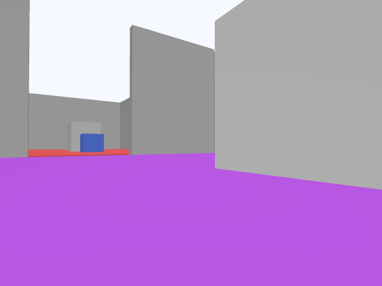

<div align="center">


# ros2-agent-workflow

**让 AI Agent 以受控、可审查、可复现的方式执行 ROS2 任务。**

医院送药是完整参考案例；产品本身是一套可迁移到其他 ROS2 机器人的标准工作流。

[English](README.en.md) · [快速开始](#快速开始) · [验证证据](#验证与数字口径) · [真机适配](docs/REAL-ROBOT.md)

[](https://docs.ros.org)
[](https://gazebosim.org)
[](https://www.python.org)
[](https://modelcontextprotocol.io)
[](#验证与数字口径)
[](https://github.com/TmxjTmxj/ros2-agent-workflow/actions/workflows/ci.yml)
[](LICENSE)

</div>

---

## 这是什么

`ros2-agent-workflow` 不是让大模型直接发布 `/cmd_vel`，也不是一个把 ROS shell
暴露给 Agent 的工具。它把一次自然语言任务收敛为经过审查的、有边界的 ROS2 操作：

```text
Profile → SafetyGateway → Adapter → evidence
```

| 层 | 职责 | Agent 不能做什么 |
|---|---|---|
| **Profile** | 声明机器人接口、任务与运动限制 | 临时指定任意 topic、速度或硬件能力 |
| **SafetyGateway** | 激活许可、1 秒心跳、急停闩锁、审计 | 绕过授权或在失联后继续运动 |
| **Adapter** | 只执行白名单内的 ROS2 动作 | 取得 shell、任意 payload 或控制面写权限 |
| **evidence** | 独立记录状态、里程计、接触和相机证据 | 由控制器单方面宣称任务成功 |

**适合展示的能力：** Agent/MCP 工具设计、ROS2 控制边界、fail-closed 安全、仿真验收、可复现工程交付。

> 医院配送保留了完整的路线、机器人模型、控制器、验收器与证据；它验证工作流，
> 但不限制工作流只能做“送药”。迁移到其他机器人时，替换经过审查的 Profile 和 Adapter。

---

## 工作流如何约束 Agent


1. Agent 通过 FastMCP 调用 `discover_robot → validate_profile → arm_robot → run_task`。
2. MCP Server 只接受类型化的任务级工具；运动请求必须先经过 `SafetyGateway`。
3. 单写入者 ROS2 控制器经由经过审查的 Adapter 驱动机器人。
4. 独立验收器保存 JSON、相机帧、接触与发布者监控；成功不由控制器自报决定。

安全状态机、失联处理和急停语义见下图。它与医院案例无关，是所有 Adapter 共用的
控制边界。


---

## 完整参考案例：医院配送

案例让 TurtleBot3 Burger 在 Gazebo 医院环境中完成 **取药 → 送药 → 巡视** 三段任务。
它使用真实轮关节 `DiffDrive` 里程计、0.22 m/s 的线速度限制和 ROS 仿真时钟预算；
前视相机是案例的 task-specific 附件，而非 Burger 原厂硬件。


### 独立验收证据

下列图片就是 schema-2 验收报告引用的原始 PNG；页面只展示这一处，避免同一证据重复出现。

| 任务开始 | 任务完成 |
|---|---|
|  |  |
| 独立相机的初始帧 | 独立相机的终态帧 |

| 当前记录的验收结论 | 证据来源 |
|---|---|
| `SUCCEEDED` | [schema-2 acceptance report](examples/hospital_delivery/evidence/acceptance_report.json) |
| 137.76 s ROS 仿真时钟，预算 ≤ 180 s | 独立 `/odom` 样本与 ROS header stamp |
| 三段端点误差 0.4999 / 0.4985 / 0.4967 m，均 ≤ 0.50 m | DiffDrive 里程计首次进入容差 |
| 禁止接触 0；`/cmd_vel` 发布者唯一 | 接触传感器和 GID 监控 |

### 演示视频

<a href="examples/hospital_delivery/evidence/官方Burger医院送药_俯视演示.mp4">
  
</a>

**[▶ 播放完整俯视演示视频（29.4 s 延时画面）](examples/hospital_delivery/evidence/官方Burger医院送药_俯视演示.mp4)**

29.4 秒是视频剪辑后的可视化时长，不是机器人任务性能指标；任务的可引用完成时间是上表中的 **137.76 s ROS 仿真时钟**。

---

## 验证与数字口径

### 当前可复现的质量边界

不同测试运行在不同解释器与运行时，因此分别报告，不合并成一个看似更大的总数。

| 范围 | 命令 | 已验证结果 | 运行边界 |
|---|---|---|---|
| Python 控制面 | `make check` | **388 个根测试通过**；81% 覆盖率；Ruff、mypy、依赖审计、wheel smoke 通过 | 干净 Python venv，不启动 ROS/Gazebo |
| 已安装控制面 | `make docker-smoke` | 8 个 CLI/MCP smoke 通过 | 轻量容器，不启动 ROS/Gazebo |
| 医院 ROS 案例 | `make test-hospital` | 150 通过 | 系统 ROS Python 与 `rclpy` 环境 |
| 完整验收 | `make docker-hospital` | 以独立报告、PNG、接触与发布者监控判定 | ROS/Gazebo Runner，300 s 墙钟保护 |

完整、可引用的命令与措辞见 [验证基线](docs/VERIFICATION-BASELINE.md)。

### 数字为何会变化

数字变化来自**实现与计量口径的更正**，不是把同一结果换个说法。以下表格同时说明
“旧数字是什么、现在该引用什么、为什么变了”。

| 历史表述 | 当前可引用口径 | 变化原因 |
|---|---|---|
| **49.62 s** 的旧运行 | **137.76 s ROS 仿真时钟** | 49.62 s 来自旧版 `VelocityControl`、0.50 m/s 上限与 ground-truth odom；当前案例使用官方 Burger 的真实轮关节 `DiffDrive`、0.22 m/s 上限和轮速积分里程计。二者不是同一物理模型或速度限制，约 50 s 变为约 138 s 是预期的口径变化，不是性能倒退。 |
| **133.2 s** 的 MCP trace 数字 | **137.76 s**（独立验收）或 **141.1 s**（完整 FastMCP 工具链） | 133.2 s 是第三段仍在运行时的一次 `task_status` 采样，不是完成时间；终态只能由独立 acceptance report 或完整 MCP trace 引用。 |
| **500+/505/509** 的合并测试数字 | **388 根测试 / 150 ROS 案例测试 / 8 容器 smoke** | 历史数字手工汇总了不同时期、不同 Python 解释器和不同 ROS 依赖环境的测试；它不是任一命令的输出，也无法整体复现。现在按真实运行边界分别报告。 |
| **29.4 s** 视频长度 | **137.76 s** 任务完成时间 | 29.4 s 是顶置相机延时视频的播放长度，只用于展示路线，不参与任务预算或验收。 |

**没有改变的内容：** 医院三段路线、经过审查的 Profile、MCP 权限边界、fail-closed
行为、1 秒心跳、180 s 仿真任务预算、300 s 墙钟验收保护，以及独立验收的成功结论。

> 因此，简历或答辩应写“388 个控制面测试通过，150 个 ROS 医院案例测试通过；
> 记录的独立医院验收为 `SUCCEEDED`，用时 137.76 s ROS 仿真时钟”，并附上本仓库的命令或证据链接。

---

## 快速开始

### 只体验标准控制面（不需要 ROS/Gazebo）

```bash
git clone https://github.com/TmxjTmxj/ros2-agent-workflow.git
cd ros2-agent-workflow

python3 -m venv .venv
.venv/bin/pip install -e ".[dev]"

# 读取已打包的审查 Profile；不连接 ROS，不会控制机器人
.venv/bin/agent-ros --json status hospital-amr

# 运行控制面质量门禁
make check
```

### 运行医院参考案例（需要 ROS 2 Lyrical + Gazebo Sim 10）

```bash
# 检查容器、GPU/显示与 ROS 运行条件
make docker-hospital-preflight

# 容器化完整案例：启动仿真、任务、独立验收与清理
make docker-hospital

# 或在本机 ROS 环境只运行案例测试
make test-hospital
```

### 从 Agent 连接

安装后的 MCP 入口是 `agent-ros-mcp`。它提供 `discover_robot`、
`validate_profile`、`arm_robot`、`run_task`、`task_status`、`cancel_task`、
`emergency_stop` 与 `get_evidence` 等有界工具；配置范例和 Runner 限定见
[Runner 文档](docs/RUNNER.md)。

### 发布前自检

```bash
make release-verify
```

该命令构建 wheel/sdist、检查包元数据、生成 SHA-256 清单，并在隔离环境安装后运行
CLI/MCP smoke。发布流程和 artifact 要求见 [RELEASE.md](docs/RELEASE.md)。

---

## 项目结构

```text
ros2-agent-workflow/
├── agent_ros/                   # Profile、SafetyGateway、Adapter、运行时与证据
├── mcp_server/                  # FastMCP Agent 入口
├── examples/hospital_delivery/  # 完整医院参考案例、验收证据和视频
├── tests/                       # 控制面、发布与 Adapter 契约测试
├── docs/                        # Runner、发布、真机和比较文档
├── Dockerfile / docker-compose.yml
└── Makefile                     # 本地、容器、验收与发布命令
```

## 下一步：真机与贡献

- 真机迁移：阅读 [REAL-ROBOT.md](docs/REAL-ROBOT.md)。硬件模式默认 `dry_run=true`，
  必须完成 operator challenge；Agent 不能直接发布 `/cmd_vel`。
- 适配器迁移：阅读 [ADAPTER-MIGRATION.md](docs/ADAPTER-MIGRATION.md)。
- 项目边界与技术对比：[项目对比](docs/PROJECT-COMPARISON.md)、[Agent 工具链对比](docs/AGENT-COMPARISON.md)。
- 贡献：阅读 [CONTRIBUTING.md](CONTRIBUTING.md)，并使用 [Issue 模板](.github/ISSUE_TEMPLATE)。

## License

[MIT](LICENSE)
