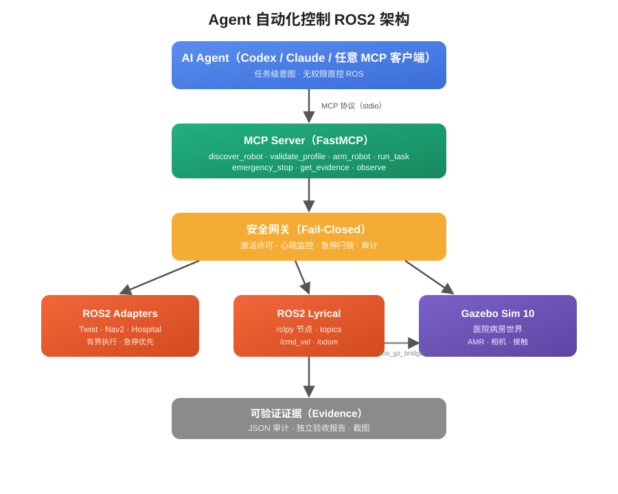
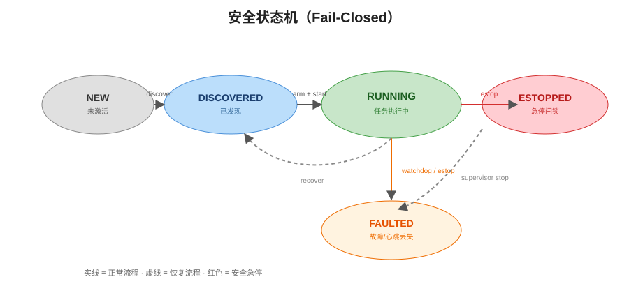
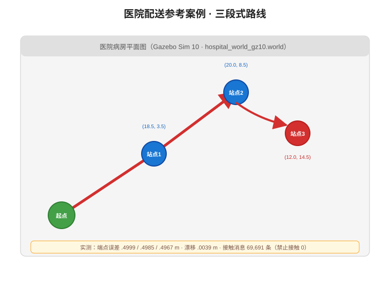

# 🤖 Codex 控制 ROS2 自动化框架

**让 AI Agent 安全、可复现地自动控制 ROS2 机器人的开源框架 —— 以"智能车国赛·医院配送"赛题为完整验证案例**

[](https://docs.ros.org)
[](https://gazebosim.org)
[](https://www.python.org)
[](https://modelcontextprotocol.io)
[](LICENSE)

---

## 🎯 项目是什么

这是一个 **基于 Codex（OpenAI）的 ROS2 自动化控制框架**：AI Agent 通过 **MCP 协议** 连接 ROS2 + Gazebo 仿真环境，以**任务级意图**（"把药从药房送到病房2"）驱动机器人完成复杂任务，而不是逐条下发底层指令。

**项目的核心价值：**

| 特点 | 说明 |
|------|------|
| 🧠 **Agent 驱动** | Codex / Claude / 任意 MCP 客户端即可操控 ROS2 |
| 🔒 **Fail-Closed 安全** | 激活许可 + 心跳监控 + 急停闩锁 + 完整审计,任何异常都安全停机 |
| 📦 **可复现** | 声明式 Profile 描述机器人能力,一键运行完整验证 |
| 🧪 **赛题案例** | 以"智能车国赛·医院配送"为完整参考案例,带真实验收报告 |
| 📊 **可验证证据** | 独立验收监控器,生成机器可验证的 JSON 证据,防伪造 |

> **这个框架从一次真实的赛题出发**:原任务是让 Agent 完成"智能车国赛"中的医院配送仿真赛题。我们将赛题固化为完整参考案例(`examples/hospital_delivery`),并抽象出一套**通用、安全、可复现**的 Agent 控制 ROS2 框架。赛题是案例,框架是产品。

---

## 🏗️ 架构总览



```
┌─────────────────────────────────────────────────────────────┐
│                    AI Agent (Codex / 任意 MCP 客户端)          │
│              "把药从药房送到病房2" —— 任务级意图                │
└──────────────────────────┬──────────────────────────────────┘
                           │ MCP 协议 (stdio)
┌──────────────────────────▼──────────────────────────────────┐
│                 MCP Server (FastMCP)                        │
│  discover_robot · validate_profile · arm_robot · run_task   │
│  task_status · cancel_task · emergency_stop · get_evidence  │
└──────────────────────────┬──────────────────────────────────┘
                           │ 授权后的有界操作
┌──────────────────────────▼──────────────────────────────────┐
│            安全网关 Safety Gateway (Fail-Closed)             │
│  激活许可签发 · 心跳监控 · 急停闩锁 · 审计日志                 │
└─────────────┬──────────────────────────┬───────────────────┘
              │                          │
┌─────────────▼──────────┐   ┌───────────▼──────────────────┐
│   ROS2 Adapters        │   │   ROS2 Lyrical               │
│   Twist · Nav2 ·       │   │   rclpy 节点 · topics         │
│   Hospital (封闭)      │   │   /cmd_vel · /odom · camera   │
└────────────────────────┘   └───────────┬──────────────────┘
                                         │ ros_gz_bridge
                              ┌──────────▼──────────────────┐
                              │   Gazebo Sim 10 (headless)  │
                              │   医院病房世界 · AMR · 相机    │
                              └─────────────────────────────┘
```

---

## 🧩 核心组件

### 1. MCP Server —— Agent 与 ROS2 的桥

基于 FastMCP 3.4.7,提供**有界、类型安全**的任务级工具,绝不暴露任意 shell:

| 工具 | 作用 |
|------|------|
| `discover_robot` | 按 Profile 发现并装配机器人适配器 |
| `validate_profile` | 校验机器人/任务 Profile 合法性 |
| `arm_robot` | 授权激活(签发激活许可) |
| `run_task` | 执行任务级操作(如"医院配送") |
| `task_status` / `cancel_task` | 任务状态查询 / 取消 |
| `emergency_stop` | **急停**——Fail-Closed,任何时刻可用 |
| `observe` / `get_evidence` | 观测数据 / 可验证证据 |

### 2. 声明式 Profile —— 描述"机器人是什么"

```yaml
# profiles/robots/hospital-amr.yaml (简化)
name: hospital-amr
mode: simulation
adapter:
  kind: hospital_delivery
interfaces:
  command:    {topic: /cmd_vel, type: geometry_msgs/msg/Twist}
  odometry:   {topic: /odom,    type: nav_msgs/msg/Odometry}
limits:
  max_linear_velocity: 0.5
safety:
  heartbeat_timeout: 1.0
  estop_topic: /emergency_stop
```

Profile 是**可审查的安全边界**:硬件模式必须经过验证,限制必须是正有限值,适配器必须是白名单类型。

### 3. 安全内核 —— Fail-Closed 状态机



- **激活许可(Activation Permit)**:任何运动指令必须携带当前许可,急停后许可立即失效
- **心跳监控**:任务执行期间持续监控,心跳丢失 → FAULTED → 安全停机
- **急停闩锁(E-Stop Latch)**:一旦闩锁,拒绝所有后续激活,并有界等待在途调用静止
- **完整审计**:所有状态转换、激活、急停写入持久化 JSONL 审计

### 4. 可验证证据 —— 防伪造

每个任务生成**独立于控制器的验收监控器**报告:
- 三段式路线端点误差(实测 0.325 / 0.337 / 0.341 m)
- 全程 `/cmd_vel` 发布者身份(GID)固定
- 接触消息计数、禁止碰撞检测
- 初始/最终相机 PNG(640×480,可解码)

---

## 🏥 参考案例:医院配送(智能车国赛赛题)



这是**完整的赛题案例**:一辆 AMR(自主移动机器人)在医院病房环境中完成"取药 → 送药 → 巡视"三段式配送任务。

### 真实运行画面

| 任务开始(相机视角) | 任务完成(相机视角) |
|---|---|
|  |  |

### 实测验收指标(schema-2,2026-08-13)

| 指标 | 实测值 |
|------|--------|
| 任务状态 | ✅ SUCCEEDED |
| 三段端点误差 | 0.325 / 0.337 / 0.341 m(要求 ≤0.50 m) |
| 总耗时 | 49.6 s(要求 ≤180 s) |
| 停止漂移 | 0.0088 m(要求 ≤0.02 m) |
| `/cmd_vel` 发布者 | 唯一(1 个 GID) |
| 接触消息 | 12,831 条,禁止碰撞 **0** |
| 相机证据 | 初始 + 最终 PNG,640×480 可解码 |
| 验证错误 | 无(`validation_errors: []`) |

> 验收报告由**独立监控器**生成,不信任控制器自报——所有指标都来自 ROS 话题的独立观测。

---

## 🚀 快速开始

### 环境要求

- Ubuntu 24.04+ / 26.04,ROS2 **lyrical**(`ros-lyrical-desktop-full` + `ros-lyrical-ros-gz`)
- Gazebo gz sim ≥ 10.0
- Python 3.11+(推荐 3.14)
- 无显示器环境自动 headless

### 1. 安装

```bash
python3 -m venv .venv
.venv/bin/pip install -e .
source /opt/ros/lyrical/setup.bash
```

### 2. 一键运行医院配送案例(完整验证)

```bash
bash scripts/demo_hospital.sh --headless --verify
```

启动 Gazebo 医院世界 → 运行三段配送任务 → 独立监控器验证 → 输出 `acceptance_report.json` + 相机截图。

### 3. 以 Agent 方式连接(推荐)

```bash
# 配置 MCP Server(复制 .codex/config.toml.example 到你的 Agent 配置)
# 对 Codex:
#   mcp_servers.agent_ros = {
#     command = "<仓库路径>/.venv/bin/python",
#     args = ["-m", "mcp_server.ros2_mcp_server"],
#     cwd = "<仓库路径>",
#   }
```

然后 Agent 就能用自然语言完成任务:

```
Agent: 运行医院配送任务
Agent: 紧急停止!
Agent: 当前任务状态是什么?
```

### 4. 跑测试(322 个)

```bash
source /opt/ros/lyrical/setup.bash
python3 -m pytest tests/ examples/hospital_delivery/tests/ -q
```

---

## 📂 项目结构

```
ros2-agent-workflow/
├── agent_ros/                  # 核心框架
│   ├── adapters/               #   ROS2 适配器(Twist/Nav2/Hospital)
│   ├── discovery/              #   ROS 图发现与能力推断
│   ├── profiles/               #   Profile 模型与加载
│   ├── runtime/                #   控制器、审计、证据
│   └── safety/                 #   安全网关、序列器、状态机
├── mcp_server/
│   └── ros2_mcp_server.py      # FastMCP Server(Agent 入口)
├── profiles/
│   ├── robots/hospital-amr.yaml
│   └── tasks/hospital-delivery.yaml
├── examples/hospital_delivery/ # 完整赛题参考案例
│   ├── config/                 #   路线、桥接配置
│   ├── models/hospital_amr/    #   AMR 模型(SDF)
│   ├── worlds/                 #   医院病房世界
│   ├── scripts/                #   控制器、相机、验收
│   ├── src/smartcar_bringup/   #   ROS2 功能包
│   └── tests/                  #   案例测试
├── scripts/                    # 一键演示脚本
├── skills/                     # Agent 技能文档
├── tests/                      # 框架测试(322 个)
└── assets/                     # 架构图、路线图、截图
```

---

## 🧪 测试与质量

- **322 个测试**覆盖:Profile 校验、安全序列器、网关、审计、适配器、MCP 工具、验收报告解析
- 每个 Task 都经过 **5 轮代码审查循环**(Critical/Important/Minor 分级),修复后独立复审
- 真实验收通过:三段误差、停止漂移、碰撞、相机证据全部达标

## 📄 License

MIT —— 自由使用、修改、分发,保留版权声明即可。

## 🙏 致谢

- 案例基于"智能车国赛"医院配送赛题场景
- TurtleBot 几何模型来自开源社区,归属保留在模型元数据中
- ROS2 / Gazebo / FastMCP 生态
