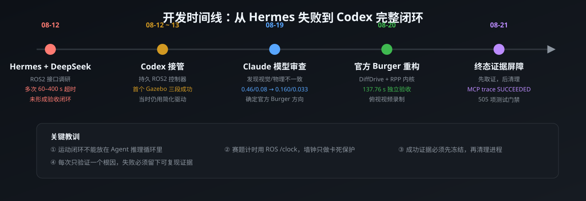

# 开发历程与工程复盘

> 这是 `ros2-agent-workflow` 的完整开发记录：从一次未闭环的 Agent 尝试，到
> 官方 TurtleBot3 Burger 物理仿真、生产 MCP 全链路和独立验收全部通过。
> 本文只保留可由仓库提交、测试和证据文件复核的事实。

## 一句话总结

用 Codex 作为 Agent，通过受限 FastMCP 工具控制真实 ROS2 接口；实时运动闭环
留在单写入者 ROS2 节点中；Gazebo 中使用官方 TurtleBot3 Burger 的
`DiffDrive` 真实轮关节完成医院三段送药任务；最终以独立里程计、相机、
接触传感器、进程清理和 MCP trace 共同证明完成。



## 项目现状

| 项目 | 状态 |
|------|------|
| 官方 Burger 直接 ROS2 三段任务 | ✅ `SUCCEEDED`，137.76 s ROS 仿真时钟 |
| 生产 FastMCP 全链路 | ✅ `SUCCEEDED`，141.1 s ROS 仿真时钟 |
| 终态证据屏障 | ✅ 已实现并有回归测试 |
| 测试门禁 | ✅ 505 个唯一测试通过 |
| 进程清理 | ✅ 运行后无 Gazebo / bridge / controller / MCP 残留 |
| 实机部署 | ⏳ 框架支持 hardware 模式，但医院案例只验证到高保真仿真 |

## 系统架构


设计原则：

- Agent 只表达任务意图，不直接发布 `/cmd_vel`
- `RuntimeController` 是唯一任务所有者，`mission_controller` 是唯一运动写者
- `SafetyGateway` 提供激活许可、心跳、急停锁存和审计
- 所有 MCP 工具都有类型约束、超时和输出 schema
- 验收器独立于控制器采样，不信任控制器自报

## 开发阶段

### 阶段 1：Hermes + DeepSeek 尝试未闭环（2026-08-12 下午）

最初目标是让 Hermes 作为多智能体调度器，调用 MCP/Skill 完成 ROS2 智能车
国赛仿真。工作记录显示当时反复出现 60–400 秒级命令超时，长时间停留在
调研、接口尝试和局部测试，没有形成可复现的“启动 → 控制 → 验证 → 清理”
闭环，也没有独立验收证据。

当天暴露出的真实技术问题被后续 Codex 阶段逐个复现并修复：

- 一个旧的 `ros2 topic pub -r 10 /cmd_vel` 进程持续覆盖停止指令
- `publisher's context is invalid` 被误判为 Python 3.14/rclpy 不可用，
  实际是进程被强杀后的关闭竞态
- Agent 直接控制运动，缺少单写入者和 fail-closed 安全边界

### 阶段 2：Codex 接管，建立第一版闭环（2026-08-12 夜间 ~ 08-13）

Codex 接管后没有继续“调研式开发”，而是先确定验收边界，再用测试驱动实现：

- `agent_ros` 框架：Profile、发现、安全网关、审计、运行时控制器
- 医院案例：固定路线、持久 `mission_controller`、精确进程生命周期
- 第一版在 Gazebo 中跑通三段路线，并生成 JSON 报告与前后相机图

这一版证明了“Agent 能控制 ROS2 + Gazebo”，但仍使用了简化驱动：
`VelocityControl + OdometryPublisher`。它绕过轮子物理，速度上限 0.50 m/s，
所以当时耗时约 39–49 秒。这个数字后来不能作为官方 Burger 的验收口径。

### 阶段 3：Claude Code 发现模型几何问题（2026-08-19）

对 `hospital_amr` 的独立审查发现：

| 参数 | 官方 Burger | 当时模型 |
|------|-------------|----------|
| 轮距 | 0.160 m | 0.46 m |
| 轮半径 | 0.033 m | 0.08 m |
| 底盘碰撞 | 0.14×0.14×0.14 m | 0.55×0.18×0.06 m |
| 视觉 mesh | Burger STL | 仍是 Burger STL |

视觉 mesh 没跟着物理参数放大，导致“小车身 + 大轮距”的画面违和。这是
“AI 生成/半自动改模型”的典型问题：改了物理尺寸，没换视觉资源。

### 阶段 4：官方 Burger + DiffDrive 物理仿真（2026-08-20）

按用户要求换回官方 TurtleBot3 Burger，并把驱动改为真实轮关节：

- `DiffDrive`：wheel_separation 0.160 m，wheel_radius 0.033 m
- 官方速度限制：0.22 m/s、1.0 rad/s、0.5 m/s²、1.0 rad/s²
- 里程计来自轮速积分，不再使用 ground-truth odom
- 引入 Nav2 Regulated Pure Pursuit 的最小可验证内核，避免逐点停车
- 赛题计时改用 ROS `/clock` 仿真时间；墙钟只做慢宿主机/失联保护
- 独立验收：137.76 s ROS 仿真时钟，三段误差均小于 0.50 m

同时录制了真实 Gazebo 顶置相机视频：


完整视频：[官方 Burger 医院送药俯视演示](../examples/hospital_delivery/evidence/官方Burger医院送药_俯视演示.mp4)

### 阶段 5：终态证据屏障与 MCP 全链路成功（2026-08-21）

最后一个问题是：任务 `succeeded` 后，运行时立即清理 ROS/Gazebo，而 MCP
随后才调用 `observe` 读取终点里程计，造成“成功取证 vs 进程清理”竞态。

修复方案：

1. 在 `RobotAdapter` 增加通用 `freeze_terminal_evidence()` 契约
2. 医院适配器直接从报告成功的状态冻结终点里程计
3. 先冻结不可变快照，再停止运动并清理进程
4. MCP 的 `observe` 只读快照，不再依赖已经关闭的 ROS 控制面

最终生产 FastMCP 工具序列全部成功：

```text
discover_robot → validate_profile → arm_robot → run_task
→ task_status → observe → stop_runtime
结果：SUCCEEDED
```

## 遇到的困难与最终解法

| # | 困难 | 根因 | 解决方案 |
|---|------|------|----------|
| 1 | Hermes 数小时未形成闭环 | 大量命令超时、缺视觉反馈、无确定性验收 | 改为 Codex + 受限 MCP + 单写入者 ROS2 控制器 |
| 2 | 停车命令被覆盖 | 旧 `ros2 topic pub -r 10 /cmd_vel` 进程仍在运行 | 精确 PID 身份校验并清理；启动前拒绝任何既有发布者 |
| 3 | rclpy 报 context invalid | 进程被强杀后的关闭竞态 | 正常关闭 + 重复零速发布；最小复现确认 rclpy 可用 |
| 4 | 小车视觉/物理不一致 | 物理放大但 mesh 未换 | 恢复官方 Burger 全部几何参数并加模型几何测试 |
| 5 | 旧版 39–49 s 结果不可信 | VelocityControl 绕过轮子 + ground-truth odom | 改用 DiffDrive 真实轮关节 + 轮速积分里程计 |
| 6 | 小车卡在房间边界 | 装饰地板自带碰撞盒，形成 2 cm 台阶 | 地板改为纯视觉，地面使用连续碰撞平面 |
| 7 | 相机画面不可用 | 相机被车壳遮挡、鱼眼视角异常 | 改为车体上方常规前视相机，640×480 可解码证据 |
| 8 | 官方 0.22 m/s 限速下跑不完 | 逐 waypoint 停车 + 错误使用墙钟计时 | RPP 最小内核连续过弯；计时改用 ROS 仿真时钟 |
| 9 | ROS graph 发现慢且不可控 | 多个 `ros2` CLI 子进程并发竞争 | 单个持久 `rclpy` graph participant 一次快照 |
| 10 | MCP 状态轮询挤爆动作历史 | 后台监控 50 ms 轮询叠加动作记录 | 状态经持久订阅，运行时轮询只读取缓存状态 |
| 11 | STOP 与 START 并发窗口 | 进程组身份尚未落盘时可能泄漏 | 跨进程锁 + 启动预约 + 精确 PGID 清理 |
| 12 | 任务成功后证据丢失 | 清理先于取证 | 终态证据屏障：先冻结快照，再清理 |
| 13 | 墙钟超时误判任务失败 | 慢宿主机 RTF 被当成赛题时间 | ROS `/clock` 管赛题预算，墙钟 600 s 只做卡死保护 |

## 调试方法

项目没有靠反复启动 Gazebo“碰运气”，而是遵守同一套流程：

1. 用真实运行或日志把失败缩小到一个组件边界
2. 先写失败回归测试，证明旧实现确实错误
3. 做最小修复，再跑针对性测试
4. 通过静态门禁和隔离 colcon 构建
5. 干净环境下执行一次完整真实验收
6. 只保留机器可验证的证据，失败记录不冒充 PASS

## 证据地图

| 证据 | 文件 |
|------|------|
| 独立验收报告 | `examples/hospital_delivery/evidence/acceptance_report.json` |
| 前后相机图 | `examples/hospital_delivery/evidence/acceptance-initial.png` / `acceptance-final.png` |
| 俯视演示视频 | `examples/hospital_delivery/evidence/官方Burger医院送药_俯视演示.mp4` |
| 生产 MCP trace | `examples/hospital_delivery/evidence/mcp_agent_trace.json` |
| 系统架构图 | `assets/architecture.svg` |
| 安全状态机 | `assets/safety-state-machine.svg` |
| 路线图 | `assets/hospital-route.svg` |
| 开发时间线 | `assets/development-timeline.svg` |
| 工具链对比 | `docs/AGENT-COMPARISON.md` |

## 数据口径

简历或面试引用请使用：

- 官方 Burger 独立验收：**137.76 s ROS 仿真时钟**
- 生产 MCP 全链路：**141.1 s ROS 仿真时钟**
- 测试数量：**505 个唯一测试**
- 49.6 s 是旧简化驱动；133 s 是 MCP trace 中的中间采样，均不是最终口径

## 结论

这个仓库证明的是一条可复现的工程路径：

```text
自然语言任务
→ 受限 MCP 工具
→ 安全授权与运行时监控
→ 单写入者 ROS2 控制
→ 高保真物理仿真
→ 独立验收证据
→ 有序停止与进程清理
```

它已经在官方 TurtleBot3 Burger 仿真案例上完整跑通；向实机迁移时，保留
Agent/MCP/安全层，替换机器人底盘适配器并完成真实传感器与场地验证即可。
